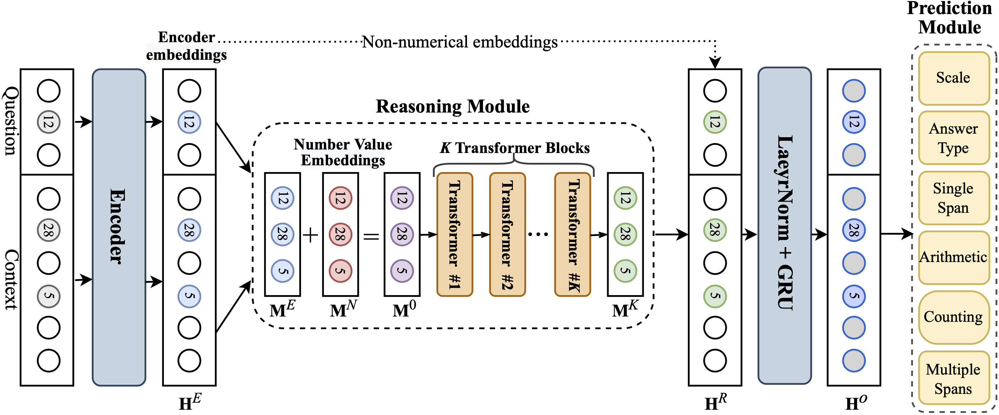

# AeNER

This is the official code repository for AeNER, a method for numerical reasoning over text and tables. AeNER uses number value embeddings that are passed through multiple Transformer layers to obtain a numerically-aware representation of the input question and the context.

## Requirements

In a new conda envorinment, install PyTorch 1.11 and other dependencies using the following command:

`pip install -r requirements.txt`

The code also supports using wandb for experiment management. If you want to use it, log in to your account using the [W&B quickstart instructions](https://docs.wandb.ai/quickstart).

## Configuration files

We developed our own experimental pipeline that works with configuration files.

A sample configuration file can be found in the `configs` directory. This file allows you to set all relevant parameters, including dataset, data path (default `aener_data`), model, and optimization hyperparameters.

## Prepare the data

To prepare the data, download the DROP dataset ([source](https://leaderboard.allenai.org/drop/submissions/get-started)) and TAT-QA dataset ([source](https://nextplusplus.github.io/TAT-QA/)). Create the following directories:

`mkdir aener_data && mkdir aener_data/drop_dataset && mkdir aener_data/tatqa_dataset`

Put the training and dev JSON files in the corresponding directories and name them as `drop_dataset_train.json`, `drop_dataset_dev.json`, `tatqa_dataset_train.json`, and `tatqa_dataset_dev.json`, respectively. Then, run the following command:

`python prepare_dataset.py --config_path configs/config.json`

This will preprocess the dataset specified in the config file and save the processed data in the .pkl format in the corresponding dataset directory.

## Training and evaluation

To train the model and evaluating, run:

`python train_eval.py --config_path configs/config.json`

To run only the evaluation on the best model checkpoint, use:

`python train_eval.py --config_path configs/config.json --is_eval True`

## Model checkpoints and configuration files

To be added.

## Credits
Some operations in the prediction module, although heavily modified, were based on the code of [NumNet+](https://github.com/llamazing/numnet_plus).

The evaluation and dataset readers were based on the [code from the original DROP paper](https://github.com/allenai/allennlp-reading-comprehension/tree/master/allennlp_rc).
